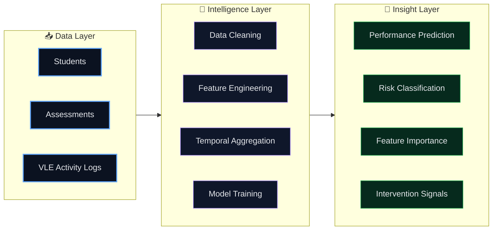
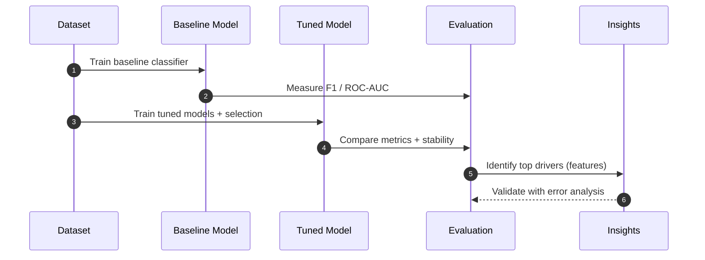

<!-- ===================================================== -->
<!--   OULAD Learning Analytics — README.md (Premium)       -->
<!--   Classy • Visual • Interactive • Recruiter-Ready      -->
<!-- ===================================================== -->

<!-- ✅ SAME BRAND BANNER STYLE (consistent across projects) -->

 

  

<a href="#-project-overview"><b>Overview</b></a> •
<a href="#-problem-framing"><b>Problem</b></a> •
<a href="#-creative-workflow"><b>Workflow</b></a> •
<a href="#-modeling-playbook"><b>Modeling</b></a> •
<a href="#-evaluation--insights"><b>Insights</b></a> •
<a href="#-contact"><b>Contact</b></a>

---

## ✨ Project Overview

This project applies **learning analytics** to the **OULAD dataset (Open University Learning Analytics Dataset)** to predict student outcomes and extract signals that can support:

- early risk detection
- targeted academic interventions
- course design improvement

This repository is written to be **portfolio-grade**: clear problem framing, measurable evaluation, and insight-driven interpretation.

---

## 🎓 Problem Framing

<b>🧩 What are we predicting? (click to collapse)</b>

 

**Goal:** predict student outcome (e.g., pass/fail/withdrawal or success vs risk) from behavioral + academic signals.

**Why it matters:** institutions can intervene earlier to improve retention and student success.

**Key challenge:** learning data is *longitudinal* + *sparse* + *behavior-driven* (clickstream-style).

---

## 🎛️ Creative Workflow

<b>🧠 Learning Intelligence Flow (click to collapse)</b>

 

---

## 🧠 Modeling Playbook

<b>🧪 “Model Ladder” (click to collapse)</b>

 

**What this demonstrates**
- Model selection thinking (not “one model and done”)
- Proper evaluation for imbalanced outcomes (precision/recall/F1)
- Insight extraction for practical interventions

---

## 📊 Evaluation & Insights

<table>
<tr>
<td width="33%" align="center" valign="top">

### 🎯 Objective
Predict student risk/success

</td>
<td width="33%" align="center" valign="top">

### 🧠 Approach
Behavior + assessments → model

</td>
<td width="33%" align="center" valign="top">

### 🚀 Output
Actionable intervention signals

</td>
</tr>
</table>

<b>🔍 What insights can you extract? (click to expand)</b>

 

- Engagement decay (drop in activity over time)
- Late/early submission patterns
- Consistency of study (regularity vs bursts)
- Module-level differences (presentation effects)
- Segments of “quiet risk” students (low activity, not yet failing)

---

## ✅ Recruiter Snapshot

<table>
<tr>
<td width="50%" valign="top">

## 🎯 Why This Project Matters

<table>
<tr>
<td width="33%" align="center" valign="top">

### 🧠 Technical Depth

- End-to-end ML pipeline design  
- Time-aware feature engineering  
- Proper validation & leakage control  
- Imbalanced classification handling  
- Metric-driven evaluation (F1 / ROC-AUC)

</td>

<td width="33%" align="center" valign="top">

### 🔎 Analytical Thinking

- Behavioral pattern extraction  
- Temporal engagement modeling  
- Risk segmentation logic  
- Feature importance interpretation  
- Error analysis mindset

</td>

<td width="33%" align="center" valign="top">

### 🚀 Real-World Impact

- Early student risk detection  
- Data-driven intervention signals  
- Retention strategy support  
- Decision-enabling insights  
- EdTech personalization potential

</td>
</tr>
</table>

---

### 📌 What a Recruiter Sees

- Not just a model — a **complete decision-support system**
- Clear separation between data, modeling, and impact
- Business-oriented ML thinking
- Portfolio-level documentation quality
- Insight-first approach, not metric-only obsession
---

## 🤝 Contact

  
OULAD Learning Analytics — built to demonstrate ML + insight-driven decision thinking.

